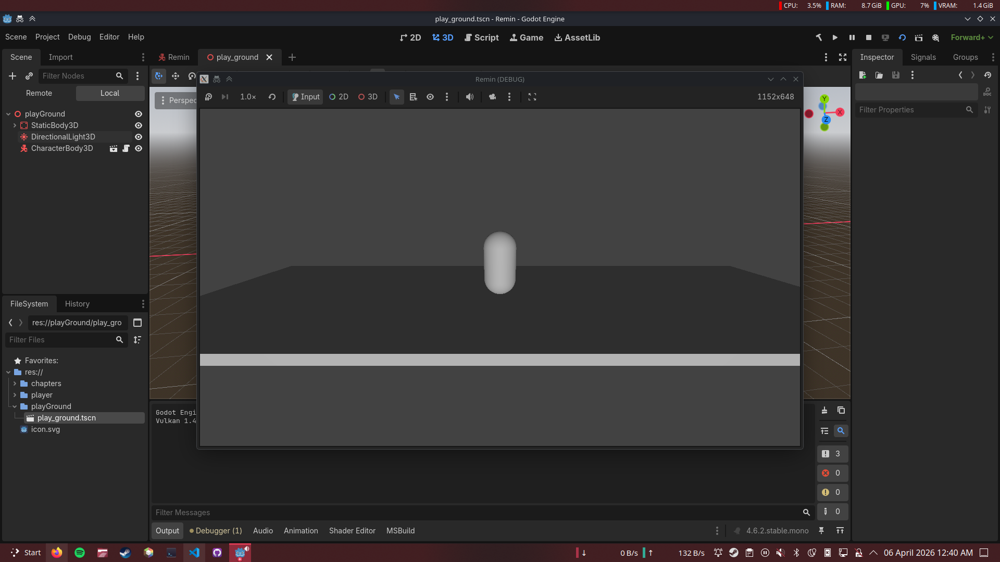

# Prototype Foundation for REMIN

Serial: 001
Status: done

The first milestone is to make a basic standing prototype

## Things that got added

- Player movement. 
- Camera control. 
- Test playground to test different stuff. 